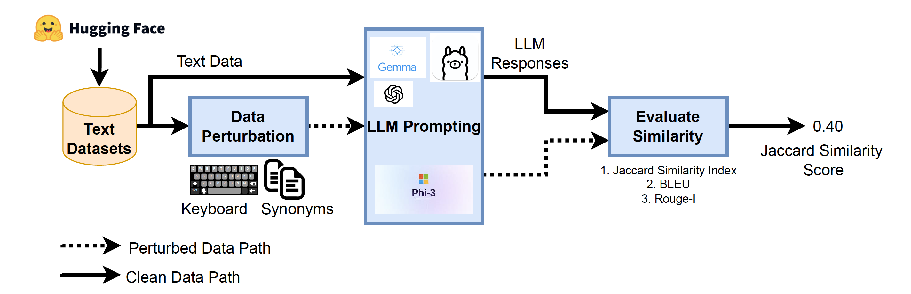

# Large Language Models Robustness Against Perturbation

Saeed S. Alahmari (Najran University-Najran-Saudi Arabia), Lawerence Hall (University of South Florida-Tampa-FL-United States), Peter R. Mouton (SRC Biosciences, Tampa-FL-United States), Dmitry Goldgof (University of South Florida-Tampa-FL-United States)

Large Language Models (LLMs) have demonstrated impressive performance across various natural language processing (NLP) tasks, including text summarization, classification, and generation. Despite their success, LLMs are primarily trained on curated datasets that lack human-induced errors, such as typos or variations in word choice. As a result, LLMs may produce unexpected outputs when processing text containing such perturbations. In this paper, we investigate the resilience of LLMs to two types of text perturbations: typos and word substitutions. Using two public datasets, we evaluate the impact of these perturbations on text generation using six state-of-the-art models, including GPT-4o and LLaMA3.3-70B. Although previous studies have primarily examined the effects of perturbations in classification tasks, our research focuses on their impact on text generation. The results indicate that LLMs are sensitive to text perturbations, leading to variations in generated outputs, which have implications for their robustness and reliability in real-world applications.

---



* Our proposed evaluation of the LLM robustness pipeline.*

---
## Dataset
The dataset for this project is adopted from 1) https://huggingface.co/datasets/hugginglearners/amazon-reviews-sentiment-analysis    and 2) https://huggingface.co/datasets/noob123/imdb_review_3000

This dataset can be found in the folder named "data", where "ori" refers to the original textual data, and "trans" refers to the perturbed textual data.

## How to Run the Code

### Prerequisites

Below are the main libraries needed to run the code

- Python 3.8
- NumPy
- Pandas
- Ollama 0.4.7
- openai 1.60
- rouge 1.0.1
- sentence-transformers 3.2.1
- together 1.3.14

### Installation

To run the code, follow the following steps. 

1.  Clone the repository:
    ```bash
    git clone https://github.com/saeedalahmari3/LLM_Robustness.git
    ```
2.  Navigate to the project directory:
    ```bash
    cd LLM_Robustness
    ```
3.  Install the required packages:
    ```bash
    pip install -r requirements.txt
    ```

### Usage

To run the main script, use the following command:


```bash
python eval_robustness.py --task infer --ori_json_path [path2ori_json] --trans_json_path [path2trans_json]
```
where the JSON files are the dataset shown in the data directory.

```bash
python eval_robustness.py --task eval --path2CSV [path2CSVfile]
```
The CSVFile should include the original text in one column and the perturbed text in the other column. 

---

## Contributing

We welcome contributions to this project! There are several ways you can help:

- **Reporting Bugs**: If you find a bug, please open an issue with as much detail as possible (steps to reproduce, expected vs. actual behavior, screenshots if applicable).
- **Suggesting Features**: Have an idea for an improvement? Open an issue and describe your suggestion. We’d love to discuss how it might fit into the project.
- **Submitting Pull Requests**: 
  1. Fork the repository
  2. Create a new branch for your feature or bugfix (`git checkout -b feature-name`)
  3. Make your changes and commit them with clear messages
  4. Push to your fork and submit a Pull Request

Please ensure your code follows the existing style and includes tests where applicable. All contributions will be reviewed, and feedback may be provided to ensure the highest quality.

Thank you for helping us improve this project!

---

## License

This project is licensed under the MIT License - see the [LICENSE.md](LICENSE.md) file for details.
